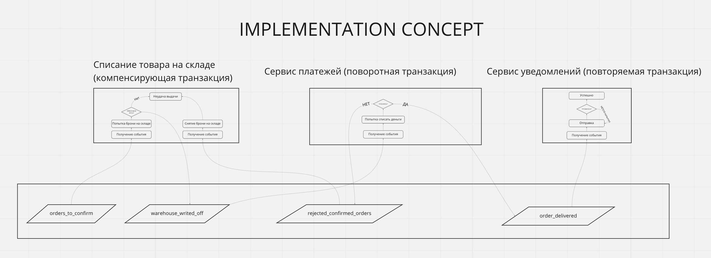

# homework-3

[Ссылка на проект в Miro.](https://miro.com/app/board/uXjVOxUTnHI=/?share_link_id=245702586717)



quick start

```docker-compose up -d```

```make migrate```

```make notify```

```make pay```

```make storage```

```make producer```

Накатить через клинт БД фикстуру склада в базу storage
migrations/storage_public_storage.sql (не придумал более элегантный способ)
